<div align="center">

# ADC — Agentic Desktop Command

### A desktop command center for orchestrating teams of autonomous coding agents across multiple projects

[](https://www.electronjs.org/)
[](https://react.dev/)
[](https://www.typescriptlang.org/)
[](https://github.com/ParkerM2/Agentic-Desktop-Command/releases/latest)
[](#license)

</div>

---

## What is ADC?

ADC is a desktop application for managing many software projects and the AI agent teams that work on them. It spawns Claude CLI sessions, watches their output in real time, runs them through automated QA loops, and ties the whole thing together with project-aware tooling — git, terminals, test running, planning, integrations.

> *"As a developer managing multiple codebases, I want to delegate tasks to AI agent teams and track their progress visually, so I can ship features faster while maintaining oversight and quality through automated QA."*

It is a single-user, local-first application. Agents are real `claude` CLI processes, not API calls — billing happens against your existing Claude subscription. Devices sync directly peer-to-peer over a TLS-pinned WebSocket; there is no central server.

---

## Architecture

<div align="center">
  <picture>
    <source media="(prefers-color-scheme: dark)" srcset="docs/images/architecture.svg">
    <source media="(prefers-color-scheme: light)" srcset="docs/images/architecture.svg">
    
  </picture>
</div>

ADC runs as three coordinated processes:

| Process | Role | Technology |
|---------|------|------------|
| **Main** | SQLite, IPC router, services, settings, file watchers | Node.js, Electron 39 |
| **Agent Host** (utility) | Spawns Claude CLI processes via PTY, parses stream-JSON output | `child_process.spawn`, MessagePort |
| **Renderer** | React UI with Feature Slice Design, TanStack Query for server state | React 19, TanStack Router/Query/Table |

**Communication paths:**
- IPC (main ↔ renderer) — Zod-validated request/response via a typed router
- MessagePort (agent host ↔ renderer) — direct streaming of agent output, bypasses main
- Correlation-ID RPC (main ↔ agent host) — request/response over MessagePort
- WebSocket P2P (device ↔ device) — TLS-pinned, Ed25519-authenticated, mDNS-discovered

Every domain follows the same eight-layer slice: `channels.ts → contract.ts → schema.ts → service.ts → handlers.ts → hooks.ts → components/ → index.ts`. SQLite is the single source of truth — there is no filesystem task system.

For details, see `docs/architecture/ARCHITECTURE.md` and `docs/architecture/DATA-FLOW.md`.

---

## Features

### Agent orchestration
Spawn, pause, resume, and terminate multiple Claude CLI agents. Tasks flow through a sortable, filterable table — Backlog → Queue → In Progress → AI Review → Human Review → Done. Launch any task into the `/implement-feature` workflow that runs agents in waves (Schema → Service → IPC → Components), enforces a mandatory test gate, and routes each component through a QA agent before integration.

### Project management
Multiple codebases with instant project switching. Per-project tabs for git (status, diff, commit, push), terminals (PTY-backed via node-pty), tasks, planning, tools, GitHub, visualization, and a browser-based test suite. Workspaces group related projects with shared concurrency limits and device assignments.

### Multi-device sync
Pair devices via PIN ritual (Settings → Peers) and sync over a direct TLS-pinned WebSocket connection. mDNS handles discovery; Ed25519 identity handles authentication; an op-log with last-write-wins merge handles replication. No central server is involved.

### Test suite
Record user interactions in an embedded browser, generate Playwright `.spec.ts` files with smart waits, run them with HTML reports, and track pass/fail per step in SQLite. Supports baselines (pixel-diff), data-driven runs (CSV/JSON substitution), shared step groups, scheduling, multiple environments, and CI export to GitHub Actions YAML.

### Productivity & integrations
Daily planner with drag-and-drop time blocks, AI-generated daily briefings, notes with tags, fitness tracking via Withings, and integrations for Slack, Discord, GitHub, Gmail, and Google Calendar (OAuth2). Persistent built-in Claude assistant for natural-language task creation, voice input/output, and screen capture.

### Long-running processes
The runners service supervises dev servers, workers, and other long-lived processes per project or per worktree. Health-checks and lifecycle events stream to the UI in real time.

For the full feature health dashboard, open `.claude/progress/adc-codebase-state-2026-04-30.html` in a browser.

---

## Tech stack

| Layer | Technology |
|-------|------------|
| Desktop shell | Electron 39 |
| UI | React 19, TanStack Router 1.95 |
| Server state | TanStack Query 5 |
| UI state | Zustand 5 |
| Styling | Tailwind CSS 4, Radix UI primitives |
| Validation | Zod 4 |
| Database | SQLite via Drizzle ORM (31 migrations) |
| Terminal | xterm.js 6, @lydell/node-pty |
| AI | Anthropic SDK 0.74, Claude CLI (spawned as child processes) |
| Multi-device sync | Direct WebSocket, TLS pinning, Ed25519 identity, mDNS discovery |
| Testing | Vitest, Playwright |

---

## Install (pre-built)

Download the latest installer from [GitHub Releases](https://github.com/ParkerM2/Agentic-Desktop-Command/releases/latest).

ADC is currently distributed unsigned. The first launch shows a security warning on both platforms — this is expected. Once bypassed, the OS remembers the choice for future launches.

### Windows

1. Download `ADC-Setup-<version>-x64.exe`
2. Double-click to run
3. SmartScreen will show **"Windows protected your PC"** → click **More info** → **Run anyway**
4. Walk through the installer wizard
5. Auto-updates work normally after install

### macOS

```sh
curl -sSL https://github.com/ParkerM2/Agentic-Desktop-Command/releases/latest/download/install-mac.sh | bash
```

This downloads the latest release, installs it to `/Applications`, and strips the Gatekeeper quarantine attribute so macOS doesn't falsely claim the app is "damaged". The script auto-detects arm64 vs x64 and launches ADC when done.

> **Why the script?** Browser downloads set `com.apple.quarantine` on the DMG, which on Sonoma 14.5+ / Sequoia triggers a blanket "damaged" Gatekeeper rejection for any app that isn't Apple-notarized. Notarization requires a paid Apple Developer subscription. Using `curl` bypasses browser quarantine, and the final `xattr -cr` scrubs anything still attached.
>
> **Manual install:** Download the DMG from [Releases](https://github.com/ParkerM2/Agentic-Desktop-Command/releases/latest), drag ADC.app to /Applications, then run `xattr -cr /Applications/ADC.app` in Terminal.

Updates are **manual** on macOS — when a new version is available, ADC shows a notification with a Download button. Run the install script again to update. Your data persists in `~/Library/Application Support/ADC/`.

---

## Quick start (development)

```bash
git clone https://github.com/ParkerM2/Agentic-Desktop-Command.git
cd Agentic-Desktop-Command
npm install
npm run dev
```

Requires Node.js ≥ 22.

| Command | Description |
|---------|-------------|
| `npm run dev` | Start in development mode (`ADC-Dev` channel) |
| `npm run build` | Production build |
| `npm run build:local` | Local production smoke test (`ADC-Local` channel, no auto-update) |
| `npm run lint` | ESLint |
| `npm run typecheck` | TypeScript |
| `npm run test:unit` | Vitest unit tests |
| `npm run test:integration` | Vitest integration tests |
| `npm run test:e2e` | Playwright end-to-end tests |

### Channels

ADC supports three data-isolated channels that can run side-by-side on the same machine:

| Channel | How to run | userData path |
|---------|------------|---------------|
| `dev` | `npm run dev` | `%APPDATA%/ADC-Dev/` |
| `local` | `npm run build:local` | `%APPDATA%/ADC-Local/` |
| `release` | Installed from a GitHub release | `%APPDATA%/ADC/` |

Each channel has its own `adc.db`, settings, auth tokens, logs, and Claude CLI state. See `docs/architecture/channels.md` for the full isolation contract.

---

## Project structure

```
src/
├── main/           # Electron main process
│   ├── features/         # 39 service domains (one folder each)
│   ├── agent-host/       # Utility process for Claude CLI spawning
│   ├── bootstrap/        # lifecycle, svc-registry, ipc-wiring, event-wiring
│   └── ipc/              # Router with Zod validation
├── preload/        # Context bridge — window.api.invoke / window.api.on
├── renderer/       # React app
│   ├── features/         # 35 feature slices (Feature Slice Design)
│   ├── shared/           # @ui primitives, hooks, stores, EventBridge
│   └── app/              # Routes, layouts, root
└── shared/         # Cross-process contracts
    ├── ipc/              # 49 domain contract folders (channels + Zod schemas)
    ├── types/            # Shared types
    └── constants/        # Routes, themes, models

drizzle/            # 31 SQLite migrations
docs/               # Architecture, patterns, peers protocol, specs
.claude/agents/     # 30 specialist agent definitions (used by /implement-feature)
.claude/progress/   # Codebase state dashboards (open the latest .html in a browser)
```

Path aliases: `@shared`, `@main`, `@renderer`, `@features`, `@ui`.

---

## How agents actually run

Agents are headless `claude` CLI sessions spawned as child processes — not Anthropic SDK API calls. The agent host:

1. Spawns `claude` via PTY with project context and a task spec
2. Streams the stream-JSON output through `StreamJsonParser`
3. Auto-restarts crashed sessions with exponential backoff (5 retries / 60 s)
4. Forwards events to the renderer via direct MessagePort (bypassing the main process for low latency)

This means billing flows through whatever Claude subscription the local CLI is logged into. There is no API key configuration in ADC.

---

## License

AGPL-3.0. Source modifications must be published under the same license; closed-source forks are not permitted.

<div align="center">

**Built by [Parker](https://github.com/ParkerM2)** · *Powered by Claude*

</div>
