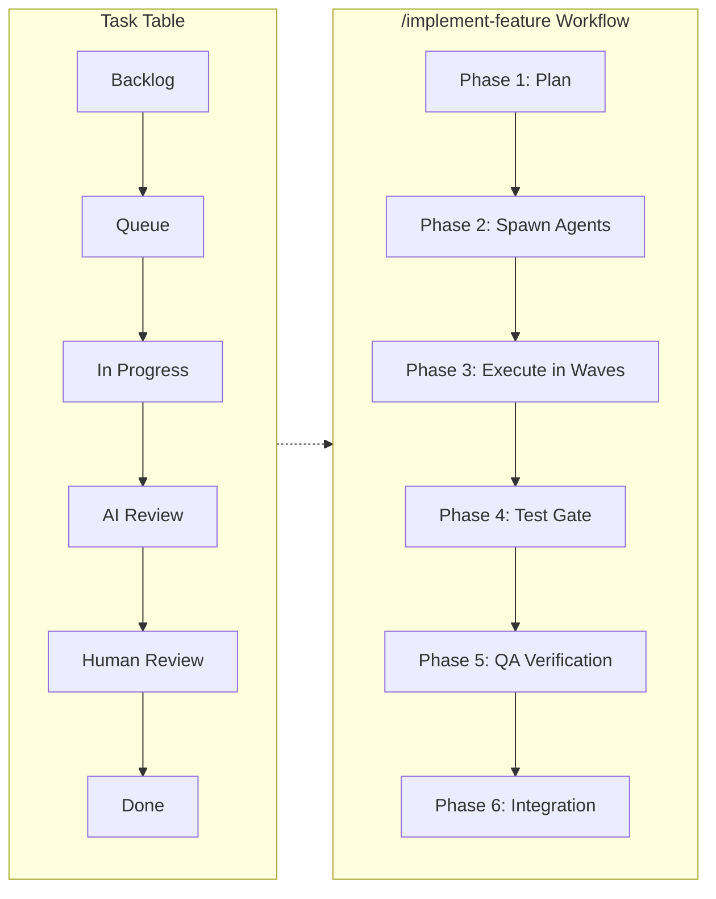
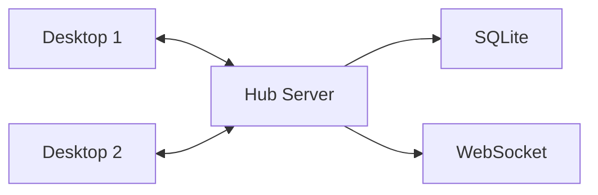

<div align="center">

# ADC — Agentic Desktop Command

### Desktop UI for multi-project management with agent team orchestration, automated QA loops, and agentic local software testing

[](https://www.electronjs.org/)
[](https://react.dev/)
[](https://www.typescriptlang.org/)
[](LICENSE)

</div>

---

## What is ADC?

ADC is a desktop application for orchestrating teams of autonomous coding agents across multiple projects. It provides a unified command center to spawn, monitor, and coordinate AI agent teams — with automated QA review loops, workflow-driven task boards, integrated terminals, git workflows, and productivity tools.

**User Story**: *"As a developer managing multiple codebases, I want to delegate tasks to AI agent teams and track their progress visually, so I can ship features faster while maintaining oversight and quality through automated QA."*

---

## Architecture

<div align="center">
  <picture>
    <source media="(prefers-color-scheme: dark)" srcset="docs/images/architecture.svg">
    <source media="(prefers-color-scheme: light)" srcset="docs/images/architecture.svg">
    
  </picture>
</div>

<details>
<summary><strong>Architecture Overview</strong></summary>

| Layer | Components | Technology |
|-------|------------|------------|
| **Renderer** | React Components, TanStack Router, React Query, Zustand | React 19, TypeScript |
| **Preload Bridge** | Typed IPC Context, window.api | Electron contextBridge |
| **Main Process** | IPC Router, 29 Services, OAuth, MCP Servers, PTY | Node.js, Electron 39 |
| **External** | Hub Server, GitHub/Spotify/Calendar APIs, Anthropic SDK | REST, WebSocket, OAuth2 |
| **Storage** | SQLite (Hub), JSON Files (Local), Task Specs | File system, SQLite |

**Data Flow**: React Query hooks call `ipc()` → Preload bridge → IPC Router → Services → External APIs/Storage

</details>

---

## Features

### Agent Team Orchestration & Control

| Feature | Description |
|---------|-------------|
| **Agent Team Management** | Spawn, pause, resume, and terminate multiple Claude CLI agents simultaneously |
| **Workflow-Driven Task Table** | Sortable, filterable task table with customizable agent workflows and `/implement-feature` skill integration |
| **Agent Queue** | Queue tasks for sequential agent execution with dependency management |
| **Progress Watching** | Real-time sync of `docs/progress/*.md` files to Hub for crash-safe tracking |
| **Task Launcher** | Launch Claude CLI sessions directly from task rows with project context |

### Automated QA Loops & Testing

| Feature | Description |
|---------|-------------|
| **QA Review Pipeline** | Automated quality gates — every task reviewed by QA agents before merge |
| **Codebase Guardian** | Structural integrity checks for architecture compliance, import health, and type safety |
| **Test Gate Enforcement** | Mandatory test suite runs before any work is claimed complete |
| **QA Agents** | AI-powered code review, regression detection, and standards enforcement |

### Multi-Project Management

| Feature | Description |
|---------|-------------|
| **Multi-Project Support** | Manage multiple codebases with instant project switching |
| **Workspaces** | Group related projects with shared settings, max concurrency limits, and device assignment |
| **Device Sync** | Multi-device support via Hub — workspaces can be hosted on specific devices |
| **Git Worktrees** | Parallel development with visual worktree management |
| **Branch Merging** | Visual conflict resolution and merge preview |

### Productivity & Integrations

| Feature | Description |
|---------|-------------|
| **Integrated Terminals** | Multi-pane terminal grid (xterm.js + node-pty) |
| **Daily Planner** | Time blocking with drag-and-drop scheduling |
| **Daily Briefing** | AI-generated summaries and task suggestions |
| **Notes & Ideas** | Quick capture with tags and pinning |
| **Spotify Controls** | Music playback without leaving the app |
| **Google Calendar** | View and create calendar events |
| **GitHub Integration** | PRs, issues, and repo management |
| **Slack/Discord** | MCP-powered communication tools |

### AI & Automation

| Feature | Description |
|---------|-------------|
| **Persistent Assistant** | Built-in Claude assistant with conversation history (Anthropic SDK) |
| **Smart Task Creation** | Natural language task decomposition |
| **Chrono Time Parser** | Parse "tomorrow at 3pm" into timestamps |
| **Voice Interface** | Speech-to-text input and text-to-speech output |
| **Screen Capture** | Quick screenshots for context sharing |
| **Email Integration** | SMTP-based notifications |
| **Notification Watchers** | Background monitoring for Slack/GitHub updates |

---

## Workflow-Driven Task Table

The Task Table provides sortable, filterable task management with customizable agent workflows:



**How It Works**:
1. Create a task in the Task Table with requirements and priority
2. Launch `/implement-feature` skill from the task row actions
3. Agents are spawned in waves (Schema → Service → IPC → Components)
4. **Mandatory test suite** runs before any work is claimed complete
5. Progress syncs to `docs/progress/*.md` for crash recovery
6. QA agents verify each component before integration

---

## Tech Stack

| Layer | Technology |
|-------|------------|
| Desktop | Electron 39 |
| UI | React 19, TanStack Router 1.95 |
| State | React Query 5, Zustand 5 |
| Styling | Tailwind CSS 4, Radix UI |
| Validation | Zod 4 |
| Terminal | xterm.js 6, @lydell/node-pty |
| Backend | Fastify 5, SQLite (Hub) |
| Testing | Vitest, Playwright |

---

## Install (Pre-built)

Download the latest installer from [GitHub Releases](https://github.com/ParkerM2/Agentic-Desktop-Command/releases/latest).

ADC is currently distributed unsigned. The first launch shows a security warning on both platforms — this is expected. Once bypassed, the OS remembers the choice for future launches.

### Windows

1. Download `ADC-Setup-<version>-x64.exe`
2. Double-click to run
3. SmartScreen will show **"Windows protected your PC"** → click **More info** → **Run anyway**
4. Walk through the installer wizard
5. Auto-updates work normally after install

### macOS

Run this single command in Terminal — it downloads the latest release, installs it to `/Applications`, and strips the Gatekeeper quarantine attribute so macOS doesn't falsely claim the app is "damaged":

```sh
curl -sSL https://github.com/ParkerM2/Agentic-Desktop-Command/releases/latest/download/install-mac.sh | bash
```

The script auto-detects arm64 vs x64 and launches ADC when done. After this, double-clicking the app works normally.

> **Why the script?** Browser downloads set `com.apple.quarantine` on the DMG, which on recent macOS (Sonoma 14.5+ / Sequoia) triggers a blanket "damaged" Gatekeeper rejection for any app that isn't Apple-notarized. Notarization requires a paid Apple Developer subscription. Using `curl` bypasses browser quarantine, and the final `xattr -cr` scrubs anything still attached — no paid subscription needed.
>
> **Manual install (if you prefer):** Download the DMG from [Releases](https://github.com/ParkerM2/Agentic-Desktop-Command/releases/latest), drag ADC.app to /Applications, then run `xattr -cr /Applications/ADC.app` in Terminal.

Updates are **manual** on macOS — when a new version is available, ADC shows a notification with a Download button that opens the releases page. Run the install script again to update. Your data persists in `~/Library/Application Support/ADC/`.

---

## Quick Start (Development)

```bash
git clone https://github.com/ParkerM2/Agentic-Desktop-Command.git
cd Agentic-Desktop-Command
npm install
npm run dev
```

| Command | Description |
|---------|-------------|
| `npm run dev` | Start development mode |
| `npm run build` | Production build |
| `npm run lint` | ESLint check |
| `npm run typecheck` | TypeScript check |
| `npm run test` | Run test suite |

---

## Project Structure

```
src/
├── main/           # Electron main process (29 services)
├── preload/        # IPC context bridge
├── renderer/       # React app (31 features)
└── shared/         # Types + IPC contract (single source of truth)

hub/                # Optional sync server (Fastify + SQLite)
.claude/agents/     # 30 specialist agent definitions
```

---

## Hub Server (Optional)

Multi-device sync and real-time collaboration:



### Running a hub

```bash
cd hub && npm install && npm run dev
# → https://localhost:3200
```

The hub listens on HTTPS with a self-signed certificate and advertises itself on the LAN via mDNS (`_adc-hub._tcp.local`). No firewall configuration beyond port 3200 is required on the happy path.

### Pairing a desktop with a hub

Hub discovery is automatic on the LAN. In the desktop app, open **Settings → Hub** to see the list of discovered hubs and click **Pair** on the one you want to use. The app generates a per-hub Ed25519 client identity, pins the hub's TLS fingerprint, and stores the paired hub under `${userData}/hubs/${hubId}/` with its own SQLite database.

The old manual `http://<ip>:3200` + API-key dance is gone. `HUB_BOOTSTRAP_SECRET` is **deprecated** and no longer required for the happy path — the two-step `/api/pair/init` → `/api/pair/confirm` handshake replaces it.

**If mDNS is blocked on your network** (some corporate VPNs, guest Wi-Fi, or hardened firewalls drop multicast), use the **Enter hub URL manually** escape hatch in the picker. Paste `https://<ip>:3200` and the app will fall back to the same pair handshake over unicast.

### Admin UI setup

Set the two admin env vars on the hub before starting it:

```bash
# Hash a password for HUB_ADMIN_PASSWORD_HASH
node hub/scripts/hash-admin-password.mjs '<your password>'

# Then export (or put in hub/.env):
export HUB_ADMIN_USER='admin'
export HUB_ADMIN_PASSWORD_HASH='<paste argon2 hash from the script>'
```

The admin UI is served at `https://<hub>:3200/admin` — sign in with those credentials to view paired clients, revoke keys, and inspect the audit log.

### Emergency rollback

If mDNS discovery or the picker is causing problems in your environment, set:

```bash
ENABLE_HUB_DISCOVERY=false
```

in the desktop app's environment. The mDNS browser and network-change watcher will not start, `HUB_EVENTS.DISCOVERY.CHANGED` stops emitting, and the legacy URL-entry + API-key **Generate / Connect** flow remains fully functional. This is an escape hatch, not the supported path — the picker is the intended UX.

---

## Stats

| Metric | Value |
|--------|-------|
| TypeScript files | ~300 |
| Feature modules | 25 |
| Main services | 29 |
| IPC handlers | 30 |
| Agent definitions | 27 |
| Color themes | 7 × 2 modes |

---

## License

AGPL-3.0 — see [LICENSE](LICENSE)

<div align="center">

**Built by [Parker](https://github.com/ParkerM2)** · *Powered by Claude*

</div>
